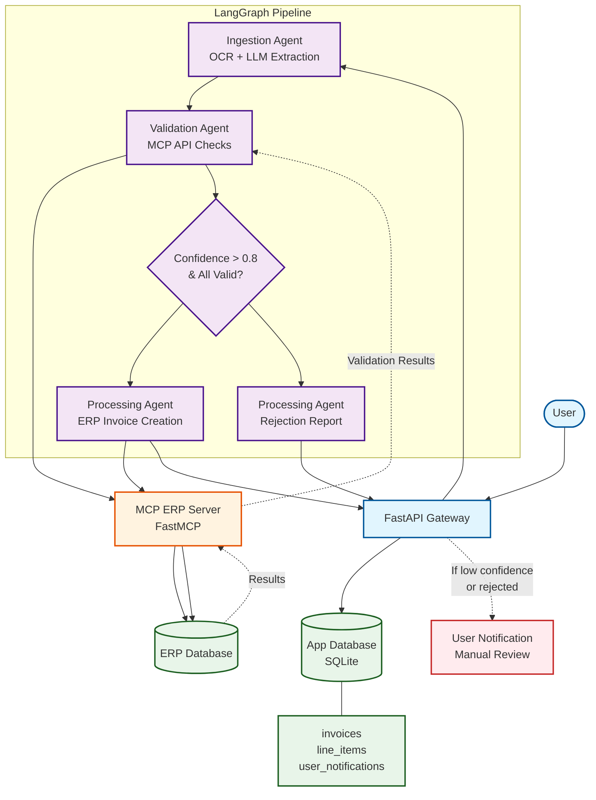

# AP Invoice Processing Agent 🧾🤖

Agentic AI system for **Accounts Payable invoice processing** using the **Model Context Protocol (MCP)** for ERP integration and **LangGraph** for multi-agent orchestration.

## Architecture



### Services

| Service | Technology | Description |
|---------|-----------|-------------|
| **API Gateway** | FastAPI | REST API for invoice upload and status |
| **Ingestion Agent** | LangGraph + OpenAI | OCR + LLM-based data extraction |
| **Validation Agent** | LangGraph + MCP Client | Validates VAT, SIRET, bank, PO against ERP |
| **Processing Agent** | LangGraph + MCP Client | Creates invoice in ERP or generates rejection |
| **MCP ERP Server** | FastMCP | Exposes ERP tools via Model Context Protocol |

### MCP ERP Tools

| Tool | Purpose |
|------|---------|
| `validate_vat` | Check VAT number in ERP supplier master |
| `validate_siret` | Check French SIRET number |
| `validate_supplier_bank` | Verify IBAN/BIC against supplier records |
| `validate_purchase_order` | Confirm PO exists and is open |
| `get_supplier_details` | Look up supplier by name |
| `create_erp_invoice` | Post invoice to ERP system |

## Quick Start

### Prerequisites
- Python 3.11+
- [uv](https://docs.astral.sh/uv/) (recommended) or pip
- [Ollama](https://ollama.com/) running locally (default) or an OpenAI API key

### Setup

```bash
# Clone and enter project
cd ap-invoice-agent

# Create .env file
cp .env.example .env
# Edit .env and configure your LLM provider (Ollama or OpenAI)

# Install dependencies
uv sync
# or: pip install -e ".[dev]"

# Seed the ERP database
uv run python -m scripts.seed_erp

# Start the API server
uv run uvicorn api.main:app --reload
```

### Process an Invoice

```bash
# Upload a sample invoice
curl -X POST http://localhost:8000/api/invoices/upload \
  -F "file=@tests/sample_invoices/sample_invoice.txt"

# Check invoice status
curl http://localhost:8000/api/invoices/1

# List all invoices
curl http://localhost:8000/api/invoices
```

### Run Tests

```bash
uv run pytest tests/ -v
```

### Docker

```bash
docker compose up --build
```

## Project Structure

```
ap-invoice-agent/
├── mcp_erp_server/          # MCP ERP Server (FastMCP)
│   ├── server.py            # 6 MCP tools
│   ├── erp_database.py      # SQLite ERP simulation
│   └── models.py            # Pydantic models
├── agents/                  # LangGraph Agents
│   ├── state.py             # Shared state
│   ├── ingestion_agent.py   # OCR + LLM extraction
│   ├── validation_agent.py  # MCP validation calls
│   ├── processing_agent.py  # ERP invoice creation
│   └── graph.py             # LangGraph workflow
├── api/                     # FastAPI Gateway
│   ├── main.py              # Routes
│   ├── schemas.py           # Response models
│   └── database.py          # SQLAlchemy persistence
└── tests/                   # Test suite
```

## License

MIT
