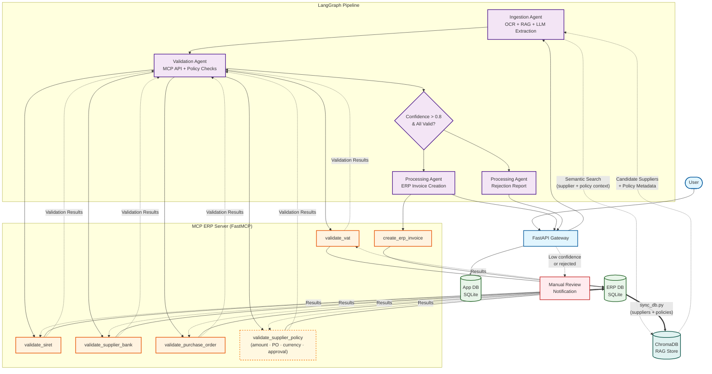
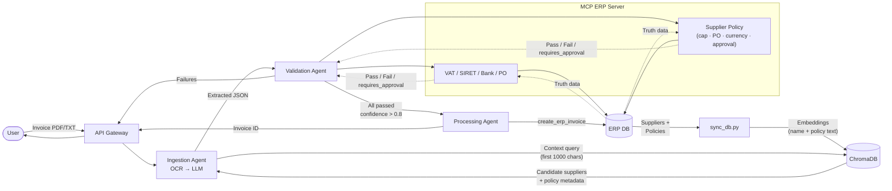

# AP Invoice Processing Agent 🧾🤖

Agentic AI system for **Accounts Payable invoice processing** using the **Model Context Protocol (MCP)** for ERP integration, **LangGraph** for multi-agent orchestration, and **ChromaDB** for RAG-based supplier fuzzy matching with embedded supplier policy rules.

---

## Architecture


```mermaid
---
config:
  layout: fixed
---
flowchart TB
 subgraph Pipeline["LangGraph Pipeline"]
        Ingestion["Ingestion Agent\nOCR + RAG + LLM Extraction"]
        Validation["Validation Agent\nMCP API + Policy Checks"]
        Routing{"Confidence > 0.8\n& All Valid?"}
        Processing["Processing Agent\nERP Invoice Creation"]
        Reject["Processing Agent\nRejection Report"]
  end
 subgraph ERP_SERVER["MCP ERP Server (FastMCP)"]
        T1["validate_vat"]
        T2["validate_siret"]
        T3["validate_supplier_bank"]
        T4["validate_purchase_order"]
        T5["validate_supplier_policy\n(amount · PO · currency · approval)"]
        T6["create_erp_invoice"]
  end
    User(["User"]) --> API["FastAPI Gateway"]
    API --> Ingestion & AppDB[("App DB\nSQLite")]
    Ingestion -. "Semantic Search\n(supplier + policy context)" .-> VectorDB[("ChromaDB\nRAG Store")]
    VectorDB -. "Candidate Suppliers\n+ Policy Metadata" .-> Ingestion
    Ingestion --> Validation
    Validation --> T1 & T2 & T3 & T4 & T5
    T1 & T2 & T3 & T4 & T5 --> ERP[("ERP DB\nSQLite")]
    ERP -. "Results" .-> T1 & T2 & T3 & T4 & T5
    T1 & T2 & T3 & T4 & T5 -. "Validation Results" .-> Validation
    Validation --> Routing
    ERP == "sync_db.py\n(suppliers + policies)" ==> VectorDB
    Routing --> Processing & Reject
    Processing --> T6
    T6 --> ERP
    Processing & Reject --> API
    API -. "Low confidence\nor rejected" .-> Notify["Manual Review\nNotification"]

     User:::user
     API:::user
     Ingestion:::agent
     Validation:::agent
     Routing:::agent
     Processing:::agent
     Reject:::agent
     T1:::tool
     T2:::tool
     T3:::tool
     T4:::tool
     T5:::policy
     T6:::tool
     ERP:::db
     AppDB:::db
     VectorDB:::rag
     Notify:::review
    classDef user   fill:#e1f5fe,stroke:#01579b,stroke-width:2px
    classDef agent  fill:#f3e5f5,stroke:#4a148c,stroke-width:2px
    classDef tool   fill:#fff3e0,stroke:#e65100,stroke-width:2px
    classDef policy fill:#fff8e1,stroke:#f57f17,stroke-width:2px,stroke-dasharray:4
    classDef db     fill:#e8f5e9,stroke:#1b5e20,stroke-width:2px
    classDef rag    fill:#e0f2f1,stroke:#004d40,stroke-width:2px
    classDef review fill:#ffebee,stroke:#c62828,stroke-width:2px
```

---

## Data Flow


```mermaid
flowchart LR
    User(["User"]) -- "Invoice PDF/TXT" --> GW["API Gateway"]
    GW --> Ing["Ingestion Agent\nOCR → LLM"]

    ERP[(ERP DB)] -- "Suppliers +\nPolicies" --> Sync["sync_db.py"]
    Sync -- "Embeddings\n(name + policy text)" --> RAG[(ChromaDB)]

    Ing -- "Context query\n(first 1000 chars)" --> RAG
    RAG -- "Candidate suppliers\n+ policy metadata" --> Ing

    Ing -- "Extracted JSON" --> Val["Validation Agent"]

    subgraph MCP["MCP ERP Server"]
        V1["VAT / SIRET / Bank / PO"]
        V2["Supplier Policy\n(cap · PO · currency · approval)"]
    end

    Val --> V1 & V2
    V1 & V2 --> ERP
    ERP -. "Truth data" .-> V1 & V2
    V1 & V2 -. "Pass / Fail / requires_approval" .-> Val

    Val -- "All passed\nconfidence > 0.8" --> Proc["Processing Agent"]
    Val -- "Failures" --> GW
    Proc -- "create_erp_invoice" --> ERP
    Proc -- "Invoice ID" --> GW --> User
```

---

## Services

| Component | Technology | Description |
|-----------|-----------|-------------|
| **API Gateway** | FastAPI | REST API for invoice upload and status |
| **Ingestion Agent** | LangGraph React Agent + ChromaDB | OCR → RAG fuzzy matching → Agent extraction (create_react_agent) |
| **Validation Agent** | LangGraph + MCP Client | Validates VAT, SIRET, bank, PO, and supplier policies |
| **Processing Agent** | LangGraph + MCP Client | Posts validated invoice to ERP |
| **MCP ERP Server** | FastMCP | Exposes ERP tools via Model Context Protocol |
| **RAG Store** | ChromaDB + OllamaEmbeddings | Supplier embeddings with embedded policy context |

---

## MCP ERP Tools

| Tool | Purpose |
|------|---------|
| `validate_vat` | Check VAT number in ERP supplier master |
| `validate_siret` | Check French SIRET number |
| `validate_supplier_bank` | Verify IBAN/BIC against supplier records |
| `validate_purchase_order` | Confirm PO exists and is open/receivable |
| `get_supplier_details` | Look up supplier by name |
| `validate_supplier_policy` | Enforce supplier-specific business rules (see below) |
| `create_erp_invoice` | Post approved invoice to ERP |

---

## Supplier Policies

Each supplier has a policy enforced at validation time by `validate_supplier_policy`. The tool checks four rules in sequence:

| Rule | Description |
|------|------------|
| **Currency** | Invoice currency must match supplier's contracted currency |
| **Amount cap** | Invoice total must not exceed `max_amount` |
| **PO requirement** | Strict suppliers require a PO number; PO-optional suppliers may submit without PO up to `allowed_without_po_max` |
| **Approval threshold** | Amounts above `approval_required_above` set `requires_approval: true` in the response |

### Supplier Policy Table

| Supplier | PO Required? | Max Cap | PO-Free Limit | Approval Threshold | Payment Terms |
|----------|-------------|---------|---------------|-------------------|---------------|
| TechnoVision SAS | ✅ Yes | €50,000 | — | €30,000 | Net 30 |
| Fournitures Dupont SARL | ✅ Yes | **€10,000** | — | €8,000 | Net 45 |
| LogiServ Europe SA | ❌ No | €100,000 | **€5,000** | €50,000 | Net 60 |
| GreenSupply France | ✅ Yes | €25,000 | — | €20,000 | Net 30 |
| MétalPro Industries | ✅ Yes | €75,000 | — | **€40,000** | Net 90 |

The `validate_supplier_policy` response includes:
```json
{
  "valid": true,
  "requires_approval": true,
  "payment_terms_days": 90,
  "policy_details": { "requires_po": true, "max_amount": 75000, ... },
  "message": "Invoice passes all supplier policies for MétalPro Industries. NOTE: Amount 47600.00 EUR exceeds the approval threshold (40000.00 EUR)."
}
```

---

## RAG: Supplier + Policy Embeddings

The `sync_db.py` script joins `suppliers` with `supplier_policies` and creates a rich document for each supplier before embedding into ChromaDB:

```
Supplier Name: LogiServ Europe SA
Address: 8 Boulevard Haussmann, Marseille, France
VAT: FR31456789012  SIRET: 45678901200035
Invoice Policy: does NOT require a Purchase Order (PO-free invoices allowed up to 5000 EUR).
               Maximum invoice cap EUR 100000. Payment terms 60 days.
Business Notes: Logistics partner. PO not required for invoices up to EUR 5,000 (spot services)...
```

This allows the **Ingestion Agent** to retrieve not just supplier identity but also applicable business rules during extraction.

---

## Test Invoice Scenarios

Five policy-scenario PDFs can be generated for end-to-end testing:

```bash
uv run python scripts/generate_policy_test_invoices.py
```

| Invoice PDF | Supplier | Amount TTC | PO? | Expected Outcome |
|-------------|----------|-----------|-----|-----------------|
| `invoice_technovision_pass.pdf` | TechnoVision SAS | €14,520 | ✅ | ✅ PASS |
| `invoice_dupont_fail_amount.pdf` | Fournitures Dupont | €14,280 | ✅ | ❌ FAIL — over €10k cap |
| `invoice_logiserv_no_po_pass.pdf` | LogiServ Europe SA | €3,900 | ❌ | ✅ PASS — PO optional under €5k |
| `invoice_green_fail_no_po.pdf` | GreenSupply France | €9,576 | ❌ | ❌ FAIL — PO required |
| `invoice_metalpro_approval.pdf` | MétalPro Industries | €57,120 | ✅ | ⚠️ PASS + approval required |

---

## Quick Start

### Prerequisites
- Python 3.11+
- [uv](https://docs.astral.sh/uv/) (recommended) or pip
- [Ollama](https://ollama.com/) running locally (default) **or** an OpenAI API key

### Setup

```bash
# Install dependencies
uv sync

# Configure your LLM provider
cp .env.example .env
# Edit .env — set OPENAI_API_KEY or leave as-is for Ollama

# (Re-)seed the ERP database with suppliers + policies
uv run python -c "from mcp_erp_server.erp_database import init_database; init_database()"

# Sync suppliers + policies into ChromaDB RAG store
# Requires Ollama running with: ollama pull nomic-embed-text
uv run python scripts/sync_db.py

# Start the API server
uv run uvicorn api.main:app --reload
```

### Process an Invoice

```bash
# Upload a sample invoice
curl -X POST http://localhost:8000/api/invoices/upload \
  -F "file=@tests/sample_invoices/invoice_technovision_pass.pdf"

# Check invoice status
curl http://localhost:8000/api/invoices/1

# List all invoices
curl http://localhost:8000/api/invoices
```

### Run Tests

```bash
# Full test suite (13 tests — includes supplier policy checks)
uv run pytest tests/ -v

# Policy tests only
uv run pytest tests/test_validation_agent.py -v -k "policy"
```

### Docker

```bash
docker compose up --build
```

---

## Project Structure

```
ap-invoice-agent/
├── mcp_erp_server/                  # MCP ERP Server (FastMCP)
│   ├── server.py                    # 7 MCP tools (incl. validate_supplier_policy)
│   ├── erp_database.py              # SQLite ERP simulation + supplier_policies table
│   └── models.py                    # Pydantic models
├── chroma_db/                       # Local ChromaDB vector store (RAG)
├── agents/                          # LangGraph Agents
│   ├── state.py                     # Shared pipeline state
│   ├── ingestion_agent.py           # OCR + RAG context + LangGraph create_react_agent
│   ├── validation_agent.py          # MCP validation (VAT, SIRET, bank, PO, policy)
│   ├── processing_agent.py          # ERP invoice creation
│   └── graph.py                     # LangGraph workflow definition
├── api/                             # FastAPI Gateway
│   ├── main.py                      # Routes
│   ├── schemas.py                   # Response models
│   └── database.py                  # SQLAlchemy persistence
├── scripts/                         # Utility scripts
│   ├── sync_db.py                   # Embed suppliers + policies into ChromaDB
│   ├── generate_policy_test_invoices.py  # Generate 5 policy-scenario PDFs
│   └── generate_sample_pdfs.py      # Generate basic sample PDFs
└── tests/
    ├── test_validation_agent.py     # 13 tests incl. all policy scenarios
    ├── test_mcp_erp_server.py
    └── sample_invoices/             # Test invoice PDFs
```

---

## License

MIT
