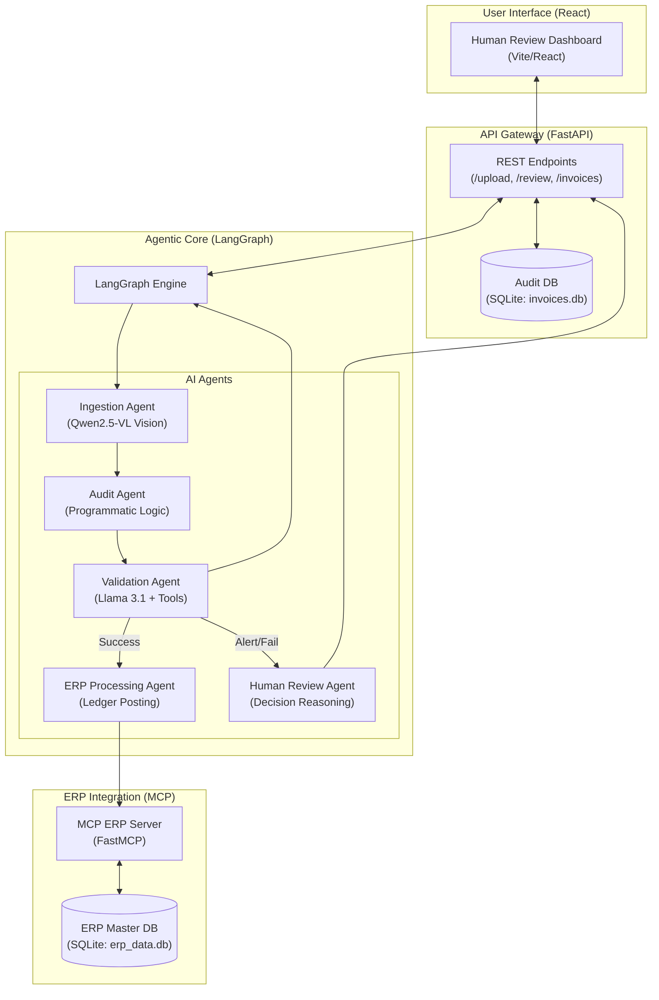
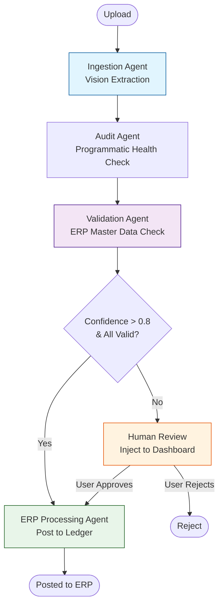
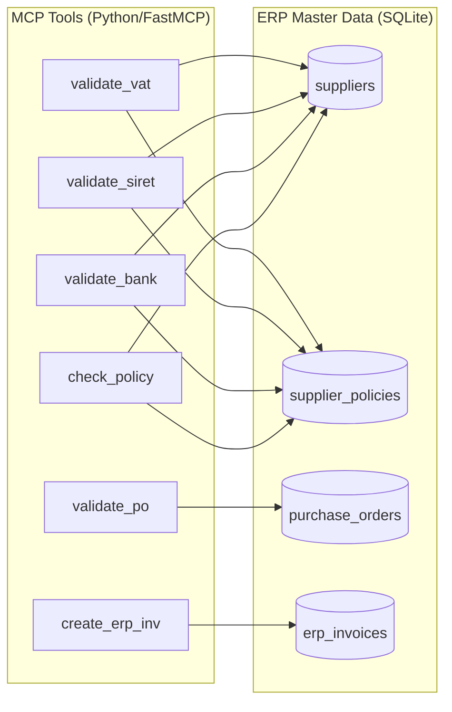

# AP Invoice Processing Agent 🧾🤖

Agentic AI system for **Accounts Payable invoice processing** using **LangGraph** for multi-agent orchestration, **MCP (Model Context Protocol)** for ERP integration, and a **Vite/React Human Review Dashboard**.

---

## 🏗️ High-Level Architecture


```mermaid
graph TB
    subgraph Frontend["User Interface (React)"]
        Dashboard["Human Review Dashboard\n(Vite/React)"]
    end

    subgraph API["API Gateway (FastAPI)"]
        RestAPI["REST Endpoints\n(/upload, /review, /invoices)"]
        AppDB[("Audit DB\n(SQLite: invoices.db)")]
    end

    subgraph Intelligence["Agentic Core (LangGraph)"]
        LG["LangGraph Engine"]
        subgraph Agents["AI Agents"]
            ING["Ingestion Agent\n(Qwen2.5-VL Vision)"]
            AUD["Audit Agent\n(Programmatic Logic)"]
            VAL["Validation Agent\n(Llama 3.1 + Tools)"]
            HRA["Human Review Agent\n(Decision Reasoning)"]
            PROC["ERP Processing Agent\n(Ledger Posting)"]
        end
    end

    subgraph External["ERP Integration (MCP)"]
        MCP["MCP ERP Server\n(FastMCP)"]
        ERPDB[("ERP Master DB\n(SQLite: erp_data.db)")]
    end

    Dashboard <--> RestAPI
    RestAPI <--> LG
    RestAPI <--> AppDB
    LG --> ING --> AUD --> VAL --> LG
    VAL -- "Success" --> PROC --> MCP
    VAL -- "Alert/Fail" --> HRA --> RestAPI
    MCP <--> ERPDB
```

---

## 🧩 Detailed Architectural View

### 1. LangGraph Pipeline Flow
The workflow manages the transition from raw image/PDF to a validated ERP record.


```mermaid
flowchart TD
    Start([Upload]) --> Ingest[Ingestion Agent\nVision Extraction]
    Ingest --> Audit[Audit Agent\nProgrammatic Health Check]
    Audit --> Validate[Validation Agent\nERP Master Data Check]
    
    Validate --> Route{Confidence > 0.8\n& All Valid?}
    
    Route -- "Yes" --> Process[ERP Processing Agent\nPost to Ledger]
    Route -- "No" --> Human[Human Review\nInject to Dashboard]
    
    Human -- "User Approves" --> Process
    Human -- "User Rejects" --> Reject([Reject])
    Process --> End([Posted to ERP])

    style Ingest fill:#e1f5fe,stroke:#01579b
    style Validate fill:#f3e5f5,stroke:#4a148c
    style Human fill:#fff3e0,stroke:#e65100
    style Process fill:#e8f5e9,stroke:#1b5e20
```

### 2. MCP ERP Server Architecture
The **Model Context Protocol** server exposes secure tools for the agents to interact with the ERP master data.


```mermaid
graph LR
    subgraph Tools["MCP Tools (Python/FastMCP)"]
        T1["validate_vat"]
        T2["validate_siret"]
        T3["validate_bank"]
        T4["validate_po"]
        T5["check_policy"]
        T6["create_erp_inv"]
    end
    
    subgraph Data["ERP Master Data (SQLite)"]
        Suppliers[(suppliers)]
        Policies[(supplier_policies)]
        POs[(purchase_orders)]
        Ledger[(erp_invoices)]
    end
    
    T1 & T2 & T3 & T5 --> Suppliers
    T1 & T2 & T3 & T5 --> Policies
    T4 --> POs
    T6 --> Ledger
```

---

## 📊 Database Schema Definitions

### Audit Database (`invoices.db`)
Tracks the agent's internal state and the audit trail for every invoice.

| Table | Purpose | Key Columns |
|-------|---------|-------------|
| `invoices` | Core audit record | `status`, `confidence_score`, `extracted_data`, `human_comment` |
| `line_items` | Extracted items | `description`, `quantity`, `unit_price`, `total` |
| `user_notifications` | Dashboard triggers | `invoice_id`, `message`, `requires_manual_review` |

### ERP Database (`erp_data.db`)
The simulated enterprise resource planning system.

| Table | Purpose | Key Columns |
|-------|---------|-------------|
| `suppliers` | Master Data | `name`, `vat_number`, `siret`, `iban`, `bic` |
| `supplier_policies` | Business Rules | `supplier_id`, `requires_po`, `max_amount`, `currency` |
| `purchase_orders` | Commitments | `po_number`, `supplier_id`, `total_amount`, `status` |
| `erp_invoices` | Final Ledger | `erp_invoice_id`, `invoice_number`, `total_ttc`, `posted_at`, `notes` |

> **Recent Update (Comments Integration):**
> * Wrote a safe `ALTER TABLE` statement inside `init_database` in order to dynamically add the `notes TEXT DEFAULT ''` column onto existing `erp_invoices` tables, ensuring backward compatibility.
> * We updated the SQLite table schema inside `_SCHEMA_SQL` to permanently integrate `notes TEXT`.
> * Updated the `create_invoice()` insert routine to accept the `notes` parameter and directly push comments to the ERP persistence layer.

---

## 🛠️ Installation & Execution

### Backend Setup
```bash
# Install dependencies
uv sync

# Seed ERP Master Data
uv run python -m scripts.seed_erp

# Initialize Audit DB & Seed Mock Data
uv run python scripts/reinit_db.py
uv run python scripts/seed_notification.py

# Start processing server (Port 8000)
uv run uvicorn api.main:app --port 8000
```

### Frontend Setup
```bash
cd human-review-ui
npm install
npm run dev # Dashboard available at http://localhost:5174
```

---

## 🧪 Demo Scenarios

1.  **Direct Upload**: Use the **"Upload Invoice"** tab on the dashboard to submit a file.
2.  **Automated Success**: Submit an invoice matching **TechnoVision SAS** master data (VAT: `FR82123456789`). It will skip human review and post directly to the ERP.
3.  **Manual Review**: Submit a file with a mismatching PO or math error. It will appear in the **"Pending Review"** tab with a detailed explanation from the AI Auditor.

---

## 📂 Project Structure

```
ap-invoice-agent/
├── mcp_erp_server/          # MCP Gateway to ERP SQLite
├── human-review-ui/         # React Dashboard source
├── agents/                  # LangGraph orchestrators & AI nodes
├── api/                     # FastAPI backend & DB models
├── scripts/                 # Seeding & Diagnostic utilities
├── tests/                   # Pytest suite & sample invoices
└── invoices.db              # Local Audit/Audit database
```

---

## 📜 License
MIT
